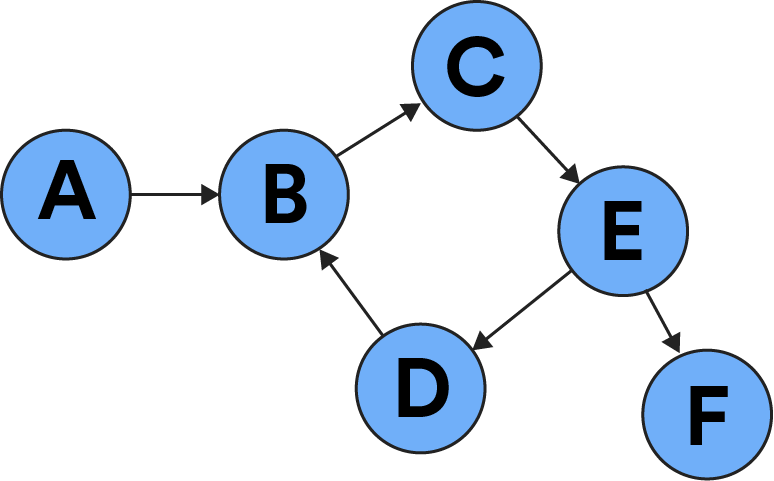
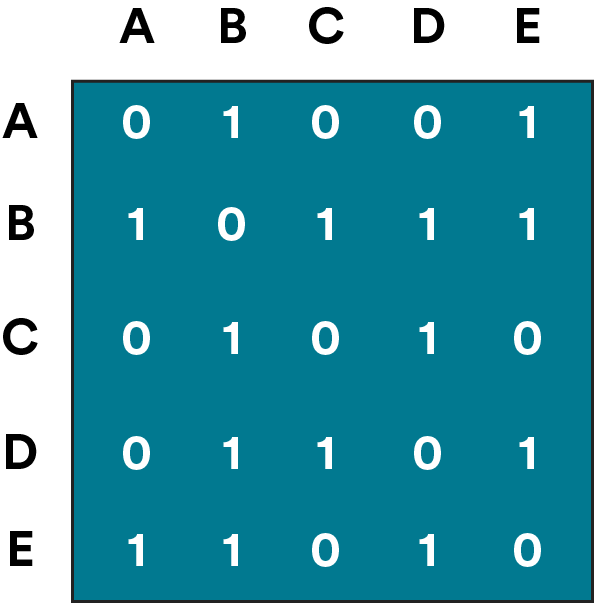

# 

Graphs are your favorite data structure that you (maybe) didn’t even know about. They power social media, maps, and more! In this lesson, we’ll learn the basics of the graph data structure and how they’re implemented.

## The One Graph to Rule Them All

<a href="https://generalassembly.wistia.com/medias/5n5czj6tvf?wvideo=5n5czj6tvf"></a>

_Transcript_

In 2013, Facebook announced an update to the way it stores data, which would revolutionize how users and developers interact with its platform: The Graph.

The Graph stores data items and the relationships between them using a — wait for it — graph data structure. Items like users, check-ins, and comments would be stored as objects, also called “nodes.” The relationship between those items — “liked by” or “friend of” — are represented as “edges” that connect the objects.

Imagine that you check in to General Assembly’s campus and tag your classmate, Francis. A few minutes later, your best friend likes the post and then your mom comments, “Have a great day at school today, honey!”

This scenario has a lot of nodes, all connected through The Graph. The check-in post is a node, and you’re connected to it as an author. Your classmate Francis is a node (a user) connected to your post as someone tagged in it. General Assembly’s campus is a node connected to your post as the location you checked in to. General Assembly, the company, is a node connected to your post as the owner of the location. The “Like” node is connected to your post, which then connects to your best friend. The “Comment” node is connected to your post, which then connects it to your mom.

That’s a lot of brand-new nodes and edges — all generated from one little post!

A graph structure is the clearest and most efficient way for Facebook to store this data, return it to users, and make it accessible to developers.

_end of transcript_

## Defining a Graph

A graph is a collection of nodes, which store data, and edges, which represent relationships or connections between nodes.

Graphs are a powerful and flexible data structure and have been widely adopted in modern software engineering. Have you ever booked a flight online, followed someone on Instagram, or driven somewhere using Google Maps? Spoiler alert: You’ve interacted with a graph.

Of course, with great power comes great responsibility — or in the case of a graph, great complexity. That complexity, however, allows complex programs to use them in so many ways.

In this lesson, we’ll explore the basics of graphs and how they’re implemented without diving too deep into the weeds.

<br>


### Knowledge Check

You know what’s represented by the nodes and edges in Facebook’s graph. What would the nodes and edges in Google Maps’ graph represent?

1. The nodes are routes; the edges are driving times.
2. The nodes are roads; the edges are locations.
3. The nodes are the recommended routes; the edges are data about the routes.
4. The nodes are the locations; the edges are roads.

<br>
<details>
<summary>
Click for answer
</summary>
<br>
The nodes are the locations; the edges are roads.

Nodes represent an object, like a location (a specific address or city), while edges represent the connections between those objects — in this case, roads.

</details>
<br>

## Graphs vs. Trees

The nodes and edges of a graph might sound similar to the nodes and edges of a tree. However, while both data structures use nodes to store data, the edges in a graph are a lot more flexible than the edges in a tree (especially the ones in a binary tree).

Trees represent data that's hierarchical in nature. Each node is connected to one "parent node" above it and one or two "children nodes" below it. By contrast, graphs represent relationships between data generally, not just hierarchically. In a graph, a node can have many edges to other nodes, and we don't use "parent / child" language to describe the relationships between nodes.

Instead, we describe the edges in a graph as **undirected** (a mutual connection between nodes) or **directed** (pointing from one node to another). Undirected and directed edges define how we categorize graphs. Next, let’s explore each type.

## Undirected and Directed Graphs

### Undirected Graphs

In an undirected graph, edges are used to form a connection between two nodes, but these edges do not point from one node to another.

Think of “friending” someone on Facebook: It’s a mutual connection that both parties accept, making it an undirected graph.

<br>


### Directed Graph

In a directed graph, edges have a direction, meaning that they point from one node to another.

Think of liking someone’s post on Facebook: You’ve established a connection between you and the post, but the connection only points that way.

<br>



## Representing Graphs

There are also two ways to represent a graph in code: an adjacency list and an adjacency matrix. At a high level:

- An **adjacency list** uses a collection of arrays for each node.
- An **adjacency matrix** is represented by a two-dimensional array.

What’s the difference? As per usual, Big O efficiency! (In this instance, we’ll let `N` represent a node and `E` represent an edge; both values have an impact on the complexity of adjacency lists and matrices.)

| Operation      | Adjacency List | Adjacency Matrix |
| -------------- | -------------- | ---------------- |
| Lookup         | `O(N)`         | `O(1)`           |
| Add a node     | `O(1)`         | `O(N^2)`         |
| Remove a node  | `O(N+E)`       | `O(N^2)`         |
| Add an edge    | `O(1)`         | `O(1)`           |
| Remove an edge | `O(E)`         | `O(1)`           |
| Memory         | `O(N+E)`       | `O(N^2)`         |

Let’s see how we’d write each type of representation.

## The Adjacency List Representation

An adjacency list is the more commonly used graph representation. In an adjacency list, a graph is represented with a collection of arrays for each node.

In code, an adjacency list looks like the example below. Each key-value pair represents a node. The `key` is the value of the node, and the `value` is an array of edges to other nodes:

```js
let graph = {
  'A': ['B', 'E'],
  'B': ['A', 'C', 'D', 'E'],
  'C': ['B', 'D'],
  'D': ['B', 'C', 'E'],
  'E': ['A', 'B', 'D'],
} 
```

### Knowledge Check

Does this adjacency list represent an **undirected** or **directed** graph?

```js
let graph = {
  'A': ['B', 'E'],
  'B': ['A', 'C', 'D', 'E'],
  'C': ['B', 'D'],
  'D': ['B', 'C', 'E'],
  'E': ['A', 'B', 'D'],
} 
```

<br>
<details>
<summary>
Click for answer
</summary>
<br>
Undirected

This is an undirected graph! How can you tell? Node A contains references to Nodes B and E; Nodes B and E both contain references to Node A. They all connect to each other.

</details>
<br>

## The Adjacency Matrix Representation

In an adjacency matrix, a graph is represented by a two-dimensional array (an array of arrays). Each subarray is a node, and the values in the node represent edges to other nodes. Conceptually, this is what it looks like:

In code, it looks like this, where a `1` represents an edge and a `0` represents a lack of an edge:

```js
let graph = [
  [0, 1, 0, 0, 1, 1],
  [1, 0, 0, 0, 1, 0],
  [0, 1, 1, 1, 0, 0],
  [0, 0, 1, 0, 1, 0],
  [1, 1, 1, 0, 0, 0],
];
```

### Knowledge Check

The adjacency matrix graph below is an undirected graph. There’s a secret clue in the graph that can help you figure that out — can you tell what it is?



<br>
<details>
<summary>
Click for answer
</summary>
<br>
Our Answer

Adjacency matrices for undirected graphs have a diagonal line running down the middle. Here, it’s all 0s. They’re also perfectly symmetrical on both sides, as the relationship between each node goes both ways.

</details>
<br>

## Making a Graph

Graphs are typically custom-built for the particular problem the developer is trying to solve. The graph that stores user data for Facebook is very different from the graph used by Google Maps.

However, there are some methods for building a graph that are common across most implementations:

- `.addNode(N)`: Add a node, `N`, to the graph.
- `.addEdge(src, dest)`: Add an edge between Nodes `src` and `dest`.

Using these two methods, we can create our first graph!

```js
// Instantiate a new instance of a graph:
const g = new Graph();

// Add three nodes, 'A', 'B', and 'C':
g.addNode('A');
g.addNode('B');
g.addNode('C');

// Create edges between our nodes:
g.addEdge('A', 'B');
g.addEdge('A', 'C');
g.addEdge('B', 'C');
g.addEdge('C', 'A');

// Each node now has at least one edge:
// A -> B, C
// B -> C
// C -> A
```

## Traversing a Graph

Once we have our graph, we need some way of traversing it (that is, navigating from one node to the next through the edges between them in order to search, count, or add nodes).

There are two common ways of traversing graphs: breadth-first search and depth-first search. (And yes, these are the same search methods that are used for binary trees!)

### Knowledge Check

Quick refresher: Choose the best definition of breadth-first search below.

1. Starting at the root node, then going to one related node, and so on, until you reach the end of the graph.

2. Moving a node out to the side once you’ve checked it so you don’t search it again.

3. Visiting each node that’s connected to the root node before proceeding to the next level of nodes.

<br>
<details>
<summary>
Click for answer
</summary>
<br>
3. Visiting each node that’s connected to the root node before proceeding to the next level of nodes.

Breadth-first search tries to stay as close to the starting point as possible before moving through the next parts of the graph and going into subsequent nodes.

</details>
<br>

### Knowledge Check

Now, how would you define depth-first search?

1. Following one chain of related nodes until you reach the bottom of the graph, then returning to the root and starting over.

2. Moving each node you’ve checked to a deeper position in the tree.

3. Checking all nodes connected to the root node, then checking their connected nodes, and so on.

<br>
<details>
<summary>
Click for answer
</summary>
<br>
1. Following one chain of related nodes until you reach the bottom of the graph, then returning to the root and starting over.

Depth-first search tries to get as far away as possible from the starting point, visiting each node until it hits a dead end and then starting over.

</details>
<br>

## Breadth vs. Depth

<a href="https://generalassembly.wistia.com/medias/diifhwbxn7?wvideo=diifhwbxn7"></a>

*Transcript*

The big question: Why would you use one search method over another?

The structure of your graph is the most important thing to consider when choosing a search method. If you know the value you’re looking for is closer to the start of the graph, breadth-first would be faster than depth-first. If the graph is very wide but not too deep, depth-first would be more efficient than breadth-first.

Think about trying to find someone on Facebook. If you wanted to find a specific person, you’d approach it differently than if you were just browsing for new friends. Say you wanted to find your long-lost best friend from kindergarten. As you comb through every possible person with their name, Facebook is using depth-first search to return those results. But if you wanted to find people to connect with on Facebook, you might use Facebook’s “People You May Know” feature. In this scenario, Facebook is using breadth-first search to show you people with whom you have things in common — mutual friends, where you live, or where you work.

**end of transcript**

## Let’s Talk About Interviews

In a job interview, you might be asked to explain how a graph works conceptually or the types of problems it might solve. Here are some resources:

- [Popular graph interview problems and solutions](https://medium.com/@codingfreak/graph-data-structure-interview-questions-and-practice-problems-22d5cd488855).
- More [common interview questions about graphs](https://stackabuse.com/graph-data-structure-interview-questions/) that don’t necessarily deal with coding.
- Practice [building a graph visually](https://visualgo.net/en/graphds).

Another popular graph-related interview question covers **Dijkstra’s shortest path algorithm**, a method for traversing a graph. The algorithm itself gets complicated, but you should familiarize yourself with the concept:

- An [overview of the algorithm](https://medium.com/basecs/finding-the-shortest-path-with-a-little-help-from-dijkstra-613149fbdc8e).
- A [visualization of the algorithm](https://www.cs.usfca.edu/~galles/visualization/Dijkstra.html).

<br>


## Graphs in Interviews

<a href="https://generalassembly.wistia.com/medias/ejo3cuqdk2?wvideo=ejo3cuqdk2"></a>

*Transcript*

They asked me a problem which was along the lines of, you have a warehouse with a bunch of server rooms and you rent those rooms so not every room is yours. You're guaranteed that at least one adjacent room to the current room you're in is yours, but not all. You want to lay out an AC duct that only touches your rooms and find the most efficient way to do so. With the problem, if you convert it into a computer science problem, it's actually an issue involving graphs. It requires a way to traverse the graph where a graph is basically one item with a bunch of connections to it. The way I solved it was - I don't know how to solve the problem, but what I did know was while studying for the interview, I remember going through a graph problem, so I had a basic idea of the approach. I took that approach and said, Okay, how can I make this approach work in this context. By doing so, I was able to deduce the specific edge cases and I ended up coming up with a real viable solution that worked optimally.

*end of transcript*